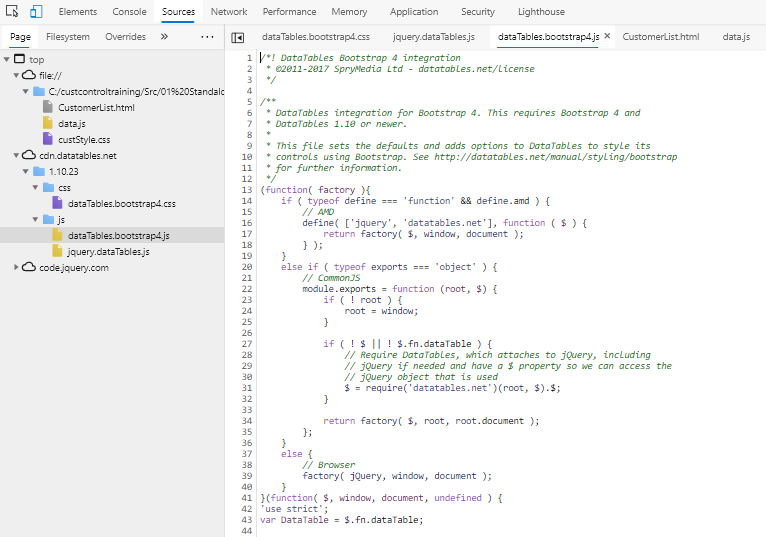
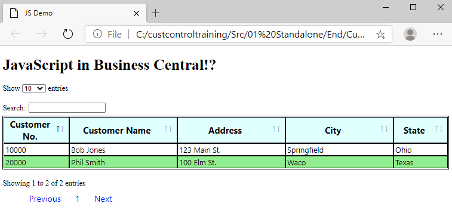
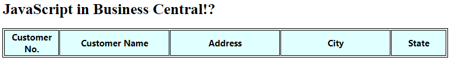

# From Begin to End
Start in a new folder in Visual Studio Code. For this tutorial the folder will be called CustomControl.

Add three files:

* CustomerList.html
* custStyle.css<br>
and
* data.js

## CustomerList.html

<dl>
<dt style="font-style:italic;font-weight:bold;font-size:14px">Note:</dt>
<dd>These can be copied exactly from the "Begin" folder in the Git repo.</dd>
</dl>

Make it easy and just copy the following into the `CustomerList.html` file:
````html
<!DOCTYPE html>
<html xmlns="http://www.w3.org/1999/xhtml">

<head>
</head>

<body>
    <h1>
        <div id="title">JavaScript in the Browser!?</div>
    </h1>
</body>
<script>
</script>

</html>
````
It saves on typing.

Fill in the scripts and links in the <head> section with the following:
````html
    <title>JS Demo</title>

    <link rel="stylesheet" type="text/css" href="https://cdn.datatables.net/1.10.23/css/dataTables.bootstrap4.css" />
    <link rel="stylesheet" type="text/css" href="custStyle.css" />

    <script type="text/javascript" src="https://code.jquery.com/jquery-3.3.1.js"></script>
    <script type="text/javascript" src="https://cdn.datatables.net/1.10.23/js/jquery.dataTables.js"></script>
    <script type="text/javascript" src="https://cdn.datatables.net/1.10.23/js/dataTables.bootstrap4.js"></script>
    <script  src="data.js"></script>
````

The `<title>` is optional.

Links in an HTML header point the browser to external files. As shown, these can exist locally or on the internet.

Scripts instruct the browser to copy and include the contents of the files listed as part of the page. 
<dl>
<dt style="font-style:italic;font-weight:bold;font-size:14px"><a href="">Proof:</a></dt>
<dd>You can see this by opening a browser (Edge, in this case), pressing <i>F12 >> Sources >> Page</i>.

</dd>
</dl>



Likewise, add the following inside the *\<body>* of the HTML file:
````html
   <h1>
        <div id="title">JavaScript in the Browser!?</div>
    </h1>
    <table id="customerTable" class="table">
        <thead>
            <tr>
                <th width=10%>Customer No.</th>
                <th width=20%>Customer Name</th>
                <th width=20%>Address</th>
                <th width=20%>City</th>
                <th width=10%>State</th>
            </tr>
        </thead>
        <tbody>
        </tbody>
    </table>
    <div id="footer"></div>
</body>
````

<dl>
<dt style="font-style:italic;font-weight:bold;font-size:14px">Some Discussion:</dt>
<dd>The HTML shown above defines a <code>Table</code> with an ID of <code>customerTable</code>. The table has a header row defined by the group of <code>th</code> elements. But something's missing.<br>There are no elements defining the data rows.<br>This is a characteristic of the <code>DataTables</code> widget chosen for this tutorial. Don't expect every widget to act accordingly (or even require a header row).</dd>
</dl>

The `<h1>` tag is an embellishment for the page and not really necessary. However, a heading on the page demonstrates whether the page is opened, even if the rest of the logic isn't working.

<dl>
<dt style="font-style:italic;font-weight:bold;font-size:14px"><a href="">Note:</a></dt>
<dd>The "id" on the table, <code>customerTable</code>, is necessary as the widget must be able to know to which control the additional styles and JS logic must be applied.

This can be seen immediately below on the layout when we add the script that will attach *DataTable* to our HTML table.</dd></dl>

The last thing to add to the HTML is the script that runs the DataTable code on the HTML element.

````html
<script>
    $(document).ready(function () {
        $('#customerTable').DataTable(
            {
                data: customers
            }
        );
    });
    
</script>
````

Briefly translated, this script is called <u>after</u> the whole of the page, including scripts downloaded from CDN, has finished running. 

The `$(document)` command actually comes from the Document Object Model (DOM), and is shorthand for, "run this code when the document finished loading."

While syntactically similar, the code `$('#customerTable')` returns the element with the `ID=customerTable`. This functionality comes from jQuery. The `DataTable` logic "applies" the functionality to that element.

Within the anonymous function, only one parameter is applied to the `DataTable` object: "data." 
<dl>
<dt style="font-style:italic;font-weight:bold;font-size:14px">Note:</dt>
<dd>As briefly discussed earlier, the data for this portion of the tutorial are static data. 

What may have been missed is that the `JSON Array of Arrays` was assigned to a variable of `customers`.

The parameter understands that some kind of JSON object will be referenced. If the variable is not a JSON object, the page will not display any data.</dd></dl>

## custStyle.css

The starting file only contains some "stubs" for a table and a heading.

````css
th {
}

td {
}
tr:nth-child(even) {
}

table, th, td {
}
````

The rest of the css file should be filled with the following. This should be copied over the original contents.

````css
th {
    font-family: 'Segoe UI', Tahoma, Geneva, Verdana, sans-serif;
    font-size: 14pt;
    background-color: lightcyan;
}

td {
    font-family: 'Segoe UI', Tahoma, Geneva, Verdana, sans-serif;
    font-size: 12pt;
}
tr:nth-child(even) {
    background-color: lightgreen;
}

table, th, td {
    border: 1px solid black;
    padding: 2px;
}

ul.pagination {
	font-family: 'Segoe UI', Tahoma, Geneva, Verdana, sans-serif;
	font-size: 12pt;
	text-align: left;
	justify-content: flex;
	list-style-type: none;
}
li {
	float: left;
}
a.page-link {
	padding-right: 15px;
	padding-left: 15px;
	display: block;
	line-height: 40px;
	text-decoration: none;
	font-family: 'Segoe UI', Tahoma, Geneva, Verdana, sans-serif;
	font-size: 18px;
}
#customerTable_filter {
	text-align: left;
	padding-top: 20px;
}
````

## Data
Lastly, we need to dummy up some data. The `data.js` file should contain the following.

````javascript
var customers = [
    [
        "10000",
        "Bob Jones",
        "123 Main St.",
        "Springfield",
        "Ohio"
    ],
    [
        "20000",
        "Phil Smith",
        "100 Elm St.",
        "Waco",
        "Texas"
    ]
]
````
Notice how the order of the `JSON Array of Arrays' matches the order of the HTML table headers.

````html
<th width=10%>Customer No.</th>	------->  "10000",
<th width=20%>Customer Name</th> -------> "Bob Jones",
<th width=20%>Address</th> ------->	      "123 Main St.",
<th width=20%>City</th> ------->          "Springfield",
<th width=10%>State</th> ------->         "Ohio"
````

The `TableData` javascript widget obviously relies on order for its layout.

## Product

When we run the CustomerList.html (either from VS Code or from a brower) we see our standalone product.



### For Comparison

If we remove the scripting that attaches the functionality and styles to the `customerTable` id, we see only this.



This shows us our empty page without everything the widget adds.

## Next
In our next module, we will transcribe our HTML, our css, and our javascript into files inside Business Central. 

We will see how things must be changed a moved, but they will still be very familiar to what we've done in our browser tutorial.
