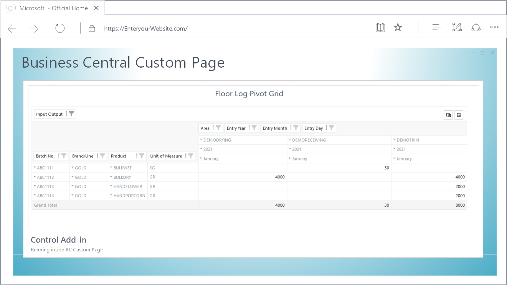
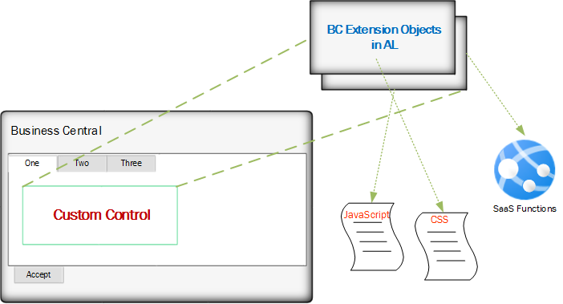

# Introduction to Control Add-ins in AL

My name is Jeff Stokes Du Bose. It is my honor today to present a tutorial, from start to finish, on Business Central interoperability known as *Control Add-ins.*. This is another in the Tigunia tutorial series of, by, and for developers.

In this module I will present a very simple design and implementation of **Control Add-ins**, JavaScript widgets or logic embedded into BC pages. Even though the prelude showed some pretty robust and visually complex examples from DevExpress, the following tutorial will use something simpler and more easily-obtainable for training. 

The rules and fundamentals for simple to complex implementations of Control Add-ins are the same, regardless of vendor or use. What you learn here can be used in every Control Add-in implementation, regarless of widget.

I can imagine some of you are saying: "why do we have to learn Control Add-ins? Didn't we have this all figured out with DLLs?" 

And you would be right &ndash; for the past. In NAV C/AL code, the more adventurous among us extended functionality and even integrated with other systems by writing custom DLLs in .NET and then calling those .NET modules from within the NAV code. Microsoft changed the rules.

In AL with Business Central, we must use different tools because we must obey different rules. New rules rose from the ways Microsoft decided to build multi-tenancy into their data and service stream. Securing tenant and company data now require that they keep us out of the operating system, and keep us out of the data unless they serve it up to us in secured, limited streams through their SaaS platform.

We can use those new rules to our advantage. We can serve up data from within our AL extenstions to our own presentation layer. And regardless of the language, our presentation layer still exists within AL pages, and, therefore, Microsoft's rules. I'm going to introduce you to those new techniques within those new rules.

In this tutorial we will explore the concepts of Control Add-ins and what makes them useable in a SaaS environment. We'll learn a step-wise approach to building and proving them, and then adding them to our AL extensions. We will then demonstrate how to pass data from the AL environment to the JavaScript environment, and how to use JavaScript to push data back to AL so we can exchange data and actions. Like all programming, once we learn the fundamentals, they apply to all the Contron Add-ins we want to create.

The simple, four-part presentation includes the following:

* this introduction with a description and design of NAV and BC and their *interoperability* differences
* An approach to build and prove the JavaScript widget <u>outside of BC</u>
* How the standalone script and layout we use changes to fit in the BC environment 
and
* Adding some logic to pass data to our Control Add-in from BC

## Architecture, Then and Now

NAV and BC share common business logic. When designing the new BC for multi-tenancy, much changed under the hood. Remnants of the past remain that make us feel at home: such as *objects* that aren't **objects**, and the textual layout of those objects reminds us of text exports of NAV, but the underlying architecture changed to allow multi-tenancy and cloud computing.

Microsoft had to change interoperability for these new security concerns. DLLs are forbidden in multi-tenancy implementations; and that should be the expected architectural model for the foreseeable future. 

The choices Microsoft made that forced this change are beyond anyone outside the Microsoft hive, but once the architecture changed, what's allowed and what's forbidden changed for security reasons.

## <a name="oldArch">Old Architecture</a>
In NAV using C/AL, add-ins written in .NET and added as DLLs in the *Add-ins* subfolder were acceptible. The *security risks* posed by DLLs in a closed domain with a local database were minimal; especially if the network administrator trusted the DLL writer. DLLs could talk to any resource inside (and in some cases, outside) the domain. The risks borne were solely those of the local enterprise running NAV. In other words, DLL Emptor.

The interoperability of the old architecture existed without compromising **anybody else's** security or integrity. Even open-ended DLLs could only corrupt those systems accessible to it. Other NAV implementations were safe by nature of networks and domains.

## <a name="newArch">New Architecture</a>
Protecting tenants in a SaaS architecture means leveraging new and available internal tools that cannot compromise other tenants or databases across a session, but still allow clients the use of powerful non-native and third-party tools. The Business Central services, running on the remote server, become the <u>only</u> way to securely send and receive data with a browser (or any client consuming those services). Microsoft allows access to the underlying data only through their service layer; never directly. 

In SaaS-based BC, the new control add-in runs within a new AL control. They creatively called it a **ControlAddIn**. ControlAddIns, like all other visual AL objects, run inside pages in the client's browser. There are no direct connections from a browser page to Business Central data. Pages running in the browser maintain a degree of isolation &ndash; even from the system on which the browser runs. This makes the browser a much better and safer platform for multi-tenancy. 

By running JavaScript in the new **ControlAddIn** &ndash; the visual parts within a Page object within the browser &ndash; Microsoft provides some architectural interoperability without compromising security because BC in the browser can only talk to internet services that limit access to one tenant and one company.

The Add-in is Dead. Long live the Control Add-in.

*Business Central allows DLLs in **on-prem** implementations, demonstrating that the design and service changes from NAV to BC do not prohibit DLLs; but multi-tenancy does.*
  

 

As shown in this graph, the Control Add-in runs within an AL Host Page on the client's machine.  Control Add-ins, then, are bounded by both the constraints of the browser and the limits of AL Data Access. The BC services *deliver* the additional JavaScript for the page when it delivers the page. The JavaScript runs within the page <u>on the client's browser</u>.

Because the Control Add-in exists within an AL host page, Microsoft included some tools to allow us to communicate to and from the Control. We will use those new interoperability tools in our later two modules.

## <a name="control">Structure of a Control Add-in</a>

The following graph shows the theoretical architecture of a BC Control Add-in.  

 
Every Control Add-in starts with the same basic structure. The first we'll discuss are our two AL "objects":

* A 'host' *Page* or *PageExtension* custom object
* A *Control Add-in* object

Both of these have \*.AL file extensions. The *Control* file/object is a little different. It does not have an AL object number. I like to think of the control object as an extension to the \*.AL host page object, but I don't know the deep architecture behind it. Regardless, it is still an AL object. The *Page* or *PageExtension* AL object refers to the control by name, so we know the system makes the control AL object discoverable to the host page. 

This is not true of the other files, even if we configure the project to have them nearby.

Those other files normally used in a Control Add-in are either JavaScript (with a *.js extension), or Cascading Style Sheets (with a *.css extension). *And although we don't show it, media &ndash; such as icons and images &ndash; can be used in the Control Add-in and would be available in our project, too. But we don't have those requirements in this tutorial.*

Generically, the files we use are as follows:

* a startup.js
* the control.js itself
* an optional Cascading Style Sheet 
* any additional JavaScript files (optional)
* any media files (optional)

 <blockquote>So now the truth is known. Control Add-ins make BC a multi-language platform and use JavaScript as the universal client-side language. This is an industry-wide trend. JavaScript now lives, side-by-side with AL, and scripting runs in the browser because the browser can interpret it. 

BC services still only talk to AL code. But AL code can now talk to script running in the browser. And script running in the browser can talk back to the AL Code.</blockquote> 

These files can reside in our project in the AL extension folder, but are only indirectly discoverable from the native BC/AL environment. They do not have to be physically in the folder with the AL objects. In fact, other JavaScript files, style sheets, or media files can also be downloaded during run-time in what is called a **Content Delivery Network**. We'll discuss and use CDNs later in our tutorial. They can be very important and useful in browser-based development.

As previously stated, Microsoft breached the walls of separation between AL code and JavaScript with some new libraries and objects that we'll use in our tutorial. These new tools provide a way for an AL developer to call a JavaScript function defined in our script, or have a JavaScript function defined in our script call a BC trigger within the host page. 

<dl>
<dt style="font-style:italic;font-weight:bold;font-size:14px"><a href="">Note:</a></dt>
<dd>SaaS capability is shown as part of the extensibility archticture, but that topic exceeds the bounds of this tutorial.   

It is worth noting that JavaScript running on the client can also reach out to online services using AJAX, but that, too, exceeds the bounds of this tutorial.</dd>
</dl> 

## <a name="widget">Tutorial Widget</a>
This demonstration uses a single, open-source JavaScript widget, almost randomly selected for simplicity and availability. The widget, [DataTables](https://www.datatables.com), adds little pizazz to a Dynamics Business Central application that cannot be found in a normal list page. However, this is a tutorial. Using the widget instead of a BC object provides ample training value &ndash; as well as simplicity for the tutorial &ndash; to be useful. 

As a requirement very important to this tutorial, anyone can obtain this widget without cost and through both downloads and content delivery network (CDN). I would, otherwise, have chosen a more robust library like DevExpress. More on our chosen widget in the next clip.
