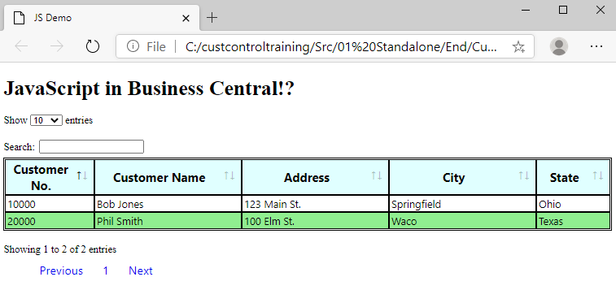
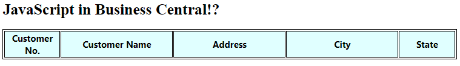

# From Begin to End

In this module we'll build a working web page with a JavaScript widget used to embellish an HTML table and data.

Before incorporating a Control Add-in into Business Central, proving that the control works outside of BC smooths the rest of the work. For this reason, this module only utilizes VS Code and a browser.

Let's get started.

Start in a new folder in Visual Studio Code. For this tutorial the folder will be called `CustomControl`.

Add three files:

* CustomerList.html
* custStyle.css<br>
and
* data.js
<br><br>

> 

<br>

<blockquote>Two instances of these files will be available under <i>01 Standalone</i>. They exist in an incomplete form in the <i>Begin</i> folder and finished in the <i>End</i> folder.</blockquote><br>


## CustomerList.html

Every Control Add-in begins with HTML scaffolding. Depending on the complexity of the data and the JS widget added, that HTML may be very simple or very complex or something in between. We'll still need it.

The simplest HTML layout has the following sections:
```html
<html>
    <head>
    </head>
    <body>
    </body>
</html>
```
## <a name="header">Header Contents</a>
Within the header the CustomerList.html file adds three kinds of content:

* a title
* links<br>
and
* scripts


<dl>
<dt style="font-style:italic;font-weight:bold;font-size:14px">Note:</dt>
<dd>The following can be copied exactly from the <i>Begin</i> folder in the Git repo.</dd>
</dl>

Make it easy and just copy the following into the `CustomerList.html` file:
````html
<!DOCTYPE html>
<html xmlns="http://www.w3.org/1999/xhtml">

<head>
</head>

<body>
    <h1>
        <div id="title">JavaScript in the Browser!?</div>
    </h1>
</body>
<script>
</script>

</html>
````
It saves on typing.

This may not be the simplest html templates known to exist, but it's close. For the record, the following have been provided:
* `<!DocType>`
* `<head></head>`
* `<body></body>` with a simple `<h1></h1>` and a bit of text
<br>and<br>
* `<script></script>`

These are simply placeholders for what will come.


## <a name="body">Body</a>
We add the `<body></body>` of *CustomerList.html*, defining a very simple HTML table.

For purely aesthetic reasons, a title `<h1>` tag presents a title for the table.


``` html
<body>
    <h1>
        <div id="title">JavaScript in Business Central!?</div>
    </h1>
    <table id="customerTable" class="table">
        <thead>
            <tr>
                <th width=10%>Customer No.</th>
                <th width=20%>Customer Name</th>
                <th width=20%>Address</th>
                <th width=20%>City</th>
                <th width=10%>State</th>
            </tr>
        </thead>
        <tbody>
        </tbody>
    </table>
    <div id="footer"></div>
</body>
```

## Table
The **id** of the `<table id="customerTable">` definion allows the *DataTable* widget to interact with the table. Otherwise, this table has no remarkable features &ndash; except that it lacks data rows.

Only header rows exist in this table definition. This is unusual as most tables have a place for data. It's a trick. The `DataTable` does this magic.

<div style="margin-left:20px;">This lack of body rows makes this an obvious requirement for the <i>DataTable</i>. Also evident, but seemingly unused, the </div>

`<div id="footer"></div>`

<div style="margin-left:20px;">must be specified so <code>DataTable</code> knows where to place the paging controls.

All of this can be found in the <code>DataTables</code> documentation.</div>

## The Header

We don't yet have content in the `<head></head>` portion of the HTML file. This is where we place links to files that should be available within the page. These include script and styles, as well as images or media (which we don't need for this tutorial).

Copy the scripts and links in the `<head></head>` section with the following:
````html
    <title>JS Demo</title>

    <link rel="stylesheet" type="text/css" href="https://cdn.datatables.net/1.10.23/css/dataTables.bootstrap4.css" />
    <link rel="stylesheet" type="text/css" href="custStyle.css" />

    <script type="text/javascript" src="https://code.jquery.com/jquery-3.3.1.js"></script>
    <script type="text/javascript" src="https://cdn.datatables.net/1.10.23/js/jquery.dataTables.js"></script>
    <script type="text/javascript" src="https://cdn.datatables.net/1.10.23/js/dataTables.bootstrap4.js"></script>
    <script  src="data.js"></script>
````

The `<title>` is optional.

Links in an HTML header point the browser to external files. As shown, these can exist locally or on the internet.

The links that reference Internet HTTPS links to CDN end-points instruct the browser to copy and include the contents of these files dynamically. 
<dl>
<dt style="font-style:italic;font-weight:bold;font-size:14px"><a href="">Proof:</a></dt>
<dd>If one of those end-points is used as a browser address, the contents of the file loads in the browser window document. Because it is text/script, it is readable. Most browsers will show the and press <code>F12</code> for the Inspector. Look at the <b>source</b> and name of every link will be shown.
</dd>
</dl><br>


The last thing to add to the HTML is the script that runs the `DataTable` code on the HTML element.

This can be seen immediately below on the layout when we add the script that will attach *DataTable* to our HTML table.<br><br>Notice that the table ID, <code>$("#customerTable")</code> returns the document element (jargon alert) and `DataTable` extends that element.</dd></dl><br><br>


````html
<script>
    $(document).ready(function () {
        $('#customerTable').DataTable(
            {
                data: customers
            }
        );
    });
    
</script>
````

Briefly translated, this script is called <u>after</u> the whole of the page, including CDN links, have finished loading. 

The `$(document)` command actually comes from the Document Object Model (DOM), and is shorthand for, "run this code when the document finished loading."

Within the anonymous function passed as a parameter in the call to `DataTable`, only one parameter is applied to the `DataTable` object: &nbsp; &nbsp; &nbsp;`data: customers`. 
<br><br>
`customers` is a JavaScript variable we'll see in `data.js`.<br>
<dl>
<dt style="font-style:italic;font-weight:bold;font-size:14px">Note:</dt>
<dd>As briefly discussed earlier, the data for this portion of the tutorial are static data. 

What may have been missed is that the `JSON Array of Arrays` was assigned to a variable of `customers`.

The parameter understands that some kind of JSON object will be referenced. If the variable is not a JSON object, the page will not display any data.</dd></dl>

## custStyle.css

The starting file only contains some "stubs" for a table and a heading.

````css
th {
}

td {
}
tr:nth-child(even) {
}

table, th, td {
}
````

The rest of the css file should be filled with the following. This should be copied over the original contents.

````css
th {
    font-family: 'Segoe UI', Tahoma, Geneva, Verdana, sans-serif;
    font-size: 14pt;
    background-color: lightcyan;
}

td {
    font-family: 'Segoe UI', Tahoma, Geneva, Verdana, sans-serif;
    font-size: 12pt;
}
tr:nth-child(even) {
    background-color: lightgreen;
}

table, th, td {
    border: 1px solid black;
    padding: 2px;
}

ul.pagination {
	font-family: 'Segoe UI', Tahoma, Geneva, Verdana, sans-serif;
	font-size: 12pt;
	text-align: left;
	justify-content: flex;
	list-style-type: none;
}
li {
	float: left;
}
a.page-link {
	padding-right: 15px;
	padding-left: 15px;
	display: block;
	line-height: 40px;
	text-decoration: none;
	font-family: 'Segoe UI', Tahoma, Geneva, Verdana, sans-serif;
	font-size: 18px;
}
#customerTable_filter {
	text-align: left;
	padding-top: 20px;
}
````

## Data
Lastly, we need to dummy up some data. The `data.js` file should contain the following.

As referenced in the script instantiating the `DataTable` control, the variable `customers` comes from this JavaScript file.

````javascript
var customers = [
    [
        "10000",
        "Bob Jones",
        "123 Main St.",
        "Springfield",
        "Ohio"
    ],
    [
        "20000",
        "Phil Smith",
        "100 Elm St.",
        "Waco",
        "Texas"
    ]
]
````
Notice how the order of the `JSON Array of Arrays' matches the order of the HTML table headers. Apparently, the widget knows which columns in which to place data only by the order in the array.

````html
<th width=10%>Customer No.</th>	------->  "10000",
<th width=20%>Customer Name</th> -------> "Bob Jones",
<th width=20%>Address</th> ------->	      "123 Main St.",
<th width=20%>City</th> ------->          "Springfield",
<th width=10%>State</th> ------->         "Ohio"
````


## Product

When we run the CustomerList.html (either from VS Code or from a brower) we see our standalone product.



### For Comparison

If we remove the scripting that attaches the functionality and styles to the `customerTable` id, we see only this.



This shows us our empty page without everything the widget adds.

## Next
In our next module, we will transcribe our HTML, css, our javascript into files inside Business Central. This includes our custom content as well as where to place the calls to the delivered content.

We will see how things must be changed and moved, but they will still be very familiar to what we've done in our browser tutorial.
