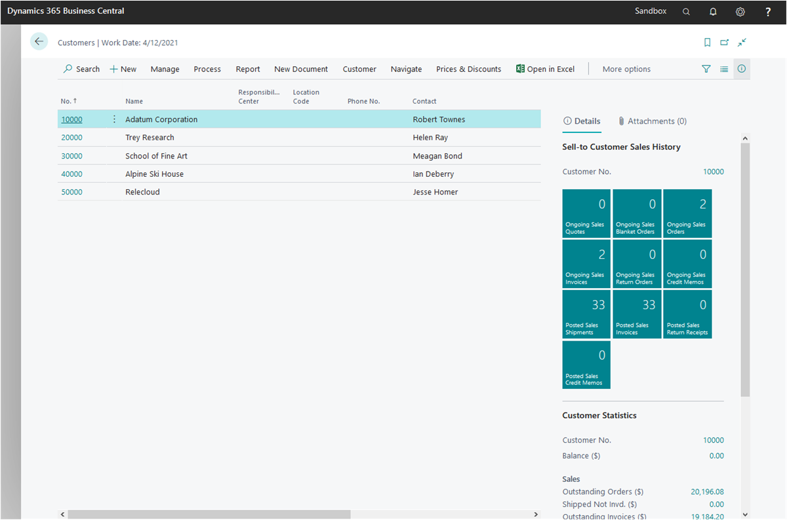
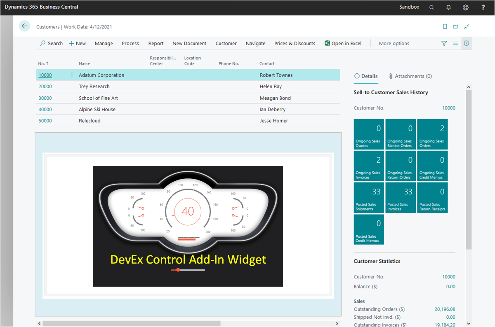
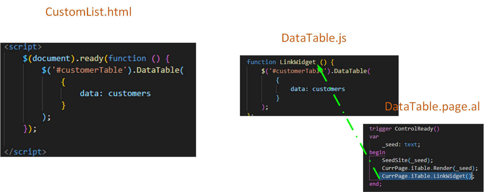

# From Begin to End: Module 02

Hello, I'm Jeff Stokes Du Bose and I'm continuing the tutorial on creating Control Add-ins in Business Central. In this module we'll transfer and restructure all the layout and code we built in Module 01 for the Standalone Web Page.

We'll see the transformations of our code and layouts, and we'll use the new tools that Microsoft provided for our Control Add-in development. 

Firstly, it's important to recognize how a Control Add-in gets **inserted** into a Business Central Page. Business Central creates an `iframe` in the `Document Object Model`. BC then places the content from our files into the `<head>` portion of the `iframe`. It manages the `<body>` of the `iframe`, and places our content in it. It does all this automatically. 

We'll start with a Customer List Page.



If we could see an empty iframe, maybe it would look like this.


BC leaves a toe-hold in the `iframe`: a `<div>` with the `id="controlAddIn"`. Because we can use the Document Object Model to search and return the element (the `<div`> in this case), we can then use some DOM trickery to insert our `HTML` scaffolding inside. 

In this way, we have our workbench where we can then run a second web page from within the Business Central web page. 

Only by searching on the page for this `<div id="controlAddIn">` can we insert anything into the page. Business Central constrains all content by placing it in an `iframe`. Of all the variables in the universe, we can depend on this one to be static for this Control Add-In. 

In other words, as we start our **Control Add-in** design, we must keep in mind that we're actually building a separte web page within an `iframe`. 



<br><hr><dl>
<dt style="font-style:italic;font-weight:bold;font-size:14px">We've been told...</dt>
<dd>For years we've been told `iframes` are scary. They're not. But they can be a playground for mischief. Everyone should be wary of who and what they place in an `iframe`. Downloading unknown or malicious web pages into an `iframe` is a bad idea. <br><br>
<br>
<br>
We're building our own web page inside the <code>iframe</code>, and if I can't trust myself, I shouldn't do this.</dd>
</dl><hr><br>

As we design our `iframe` web page, we understand that it's just like every other web page, but now BC is in charge. We have to use the tools BC provides to control what runs in our page and when. 

In terms of stages of running code, the following is a good road map:
* The start of everything we want to control goes into `startup.js`.
  * get the `id="controlAddIn"` element 
  * call the **trigger** inside our `usercontrol` in our BC page that will send in the HTML
  * Call the JavaScript function that we know will attach the JavaScript widget to our HTML scaffolding
* We'll consume `DataTable.js` and `data.js` and `custStyle.css` files as links in the `StyleSheets` and `links` assignments inside our `iDataTable.controladdin.al` file
* Our `usercontrol` trigger will call the JavaScript functions that now reside in out `iframe` page.


I don't expect anyone to understand that the first time through. We'll watch it and then you can review this again.

Let's start.

## Building a Business Central Extension

To simplify as a start, this time we're writing a Business Central Extension. That's the primary approach for Control Add-ins. We build the extension first and populate the Control Add-in logic later. 

Our BC extension project looks familiar: This one was created by using the `AL: Go` command in the *Command Palette*, and adjusting both the launch.json and the app.json files. The other `*.json` files of an extension project are there, too.

These files are provided in the Git and LMS projects, so I won't go into the differences here. You will likely change them for your environment and container specifications. 

## ControlAddIn

What's important is what's beneath the new folder, **ControlAddIn**. In total, I have included six files in my project:

* `custStyle`
* `data.js`
* `DataTable.js` 
* `startup.js`
### Two AL Files
The two `*.al files are:

* `DataTable.page.al`<br>
**DataTable.page.al** is a custom page that will consume the control add-in control.
<br>and
* `iDataTable.controladdin.al`
**iDataTable.controladdin.al** is the definition for the control add-in.

## DataTable.page.al

The very limited definitions of a card page can be used to stub in our first AL file.

````php
page 50100 DataTable
{
    PageType = Card;
    ApplicationArea = All;
    UsageCategory = Administration;

    layout
    {
        area(Content)
        {
            usercontrol(iTable; iDataTable)
            {
                ApplicationArea = all;

            }
        }
    }
}
````
A page that holds a `usercontrol` is a common card type Page. What's different is the introduction of a new page part.

Notice in the **layout/area** the `usercontrol` keyword defines the page part of the controladdin object.

This is all we need to stub in our AL page.
## Let's Make This Work

In my opinion, the most complicated object is the new Control Add-in. So let's start there first.

First, a bit of trivia: I like to use the same nomenclature of an *interface* in C# for the *controladdin* object name. In a sense, this is accurate. Debate will commence.

The code in the stub of the `controladdin` is simple:

````cs
controladdin iDataTable 
{
    StartupScript = '.\controladdin\startup.js';
 

    HorizontalStretch = true;
    HorizontalShrink = true;
    VerticalShrink = true;
    VerticalStretch = true;
    RequestedHeight = 700;
    MinimumHeight = 300;
    RequestedWidth = 800;
    MinimumWidth = 500;
}
````

These properties can be used over and over. You may want to change their value for your own preferences, but the list is a good start. 

The `StartupScript` is <u>critical</u>. BC will read what's in that JavaScript file and run it after all else in the page has loaded. This is the equivalent of the `$(document).ready` functionality we used in Module 01.

The rest of the properties define the control size. Without them, the size will be something small and unusable.


Just under the `StartupScript` line, add the following:

````perl
    StyleSheets = 'https://cdn.datatables.net/1.10.23/css/dataTables.bootstrap4.css',
                '.\ControlAddIn\custStyle.css';

    scripts = 'https://code.jquery.com/jquery-3.3.1.js',
            'https://cdn.datatables.net/1.10.23/js/jquery.dataTables.js',
            'https://cdn.datatables.net/1.10.23/js/dataTables.bootstrap4.js',
            '.\ControlAddIn\DataTable.js',
            '.\ControlAddIn\data.js';
````
These should look very familiar. They used to be `<link>`s and `<script>`s in the `<head>` block of the `CustomerList.html` file in Module 01.

The syntax is changed. 

All content are now strings, not elements. And `StyleSheets` and `scripts` both have **lists** of these strings, separated by commas. 

This is sometimes hard to get right, but VS Code will help. It will alert the coder if it cannot find a file. For example, if you have misspelled the name, VS Code will underline it with an angry red squiggle. 

There are two additional kinds of content in the new *Control Add-in* object.

The first is an **Event**

````cs
    event ControlReady();
````
This refers to an AL trigger that we'll see added under tha page part that instantiates the *Control Add-in*.


<br><hr><dl>
<dt style="font-style:italic;font-weight:bold;font-size:14px"><a href="">Note:</a></dt>
<dd>Whenever you see an <b>event</b> defined in the <i>Control Add-in</i>, it will refer to a trigger of the <i>usercontrol</i> on the page. <br><br>

Just like the <code>OnValidate</code> or <code>OnAssistEdit</code> triggers, these are triggers. Unlike the default page part triggers, these are user-defined.</dd>
</dl>
<hr>
<br>

The other type are **procedures**. Do not confuse these with AL procedures.

````pascal
    procedure Render(HTLM: Text);
   
    procedure LinkWidget();
````
These refer to the <span style="color: #aaaaff;font-size:14pt">JavaScript</span> functions in the *JavaScript* file, **DataTable.js**. They're defined in the **ControlAddIn** object so other AL objects can reference them without error.

An example of such a call will be seen in the page, like this: `CurrPage.iTable.Render(_seed);`

<br><hr><dl>
<dt style="font-style:italic;font-weight:bold;font-size:14px"><a href="">Hmm...</a></dt>
<dd>This is very reminescent of how we used to call controls in page parts in NAV.</dd>
</dl><hr><br>

## DataTable.page.al

We've got some code to add to `DataTable.page.al`. 

In the user control, add the following:

````js
            usercontrol(iTable; iDataTable)
            {
                ApplicationArea = all;

                trigger ControlReady()
                var
                    _seed: text;
                begin
                    SeedSite(_seed);
                    CurrPage.iTable.Render(_seed);
                    CurrPage.iTable.LinkWidget();
                end;
            }
        }
````

The important part is the trigger.

But first, the `SeedSite` procedure needs to be defined.

````js
    local procedure SeedSite(var _seed: text)
    begin
        _seed := '<h1> ';
        _seed += '<div id="title">JavaScript in Business Central!?</div> ';
        _seed += '</h1> ';
        _seed += '<table id="customerTable" class="table"> ';
        _seed += '<thead> ';
        _seed += '<tr> ';
        _seed += '<th width=10%>Customer No.</th> ';
        _seed += '<th width=20%>Customer Name</th> ';
        _seed += '<th width=20%>Address</th> ';
        _seed += '<th width=20%>City</th> ';
        _seed += '<th width=10%>State</th> ';
        _seed += '</tr> ';
        _seed += '</thead> ';
        _seed += '<tbody> ';
        _seed += '</tbody> ';
        _seed += '</table> ';
    end;
````
This was described earlier as a transformation from `HTML` to `AL`. But we must put it in a text variable (named `_seed`) so we can send it to the `Render` function in JavaScript.

<br><hr><dl>
<dt style="font-style:italic;font-weight:bold;font-size:14px">More than one way...</dt>
<dd>This step may be unnecessary because we could put the `HTML` scaffolding in the `Render` function itself. That would make the function look more like this:
<pre>
function Render() {
    var _seed = '&lt;h1&gt; ';
        _seed += '&lt;div id="title"&gt;JavaScript in Business Central!?&lt;/div&gt; ';
        _seed += '&lt;/h1&gt; ';
        _seed += '&lt;table id="customerTable" class="table"&gt; ';
        _seed += '&lt;thead&gt; ';
        _seed += '&lt;tr&gt; ';
        _seed += '&lt;th width=10%&gt;Customer No.&lt;/th&gt; ';
        _seed += '&lt;th width=20%&gt;Customer Name&lt;/th&gt; ';
        _seed += '&lt;th width=20%&gt;Address&lt;/th&gt; ';
        _seed += '&lt;th width=20%&gt;City&lt;/th&gt; ';
        _seed += '&lt;th width=10%&gt;State&lt;/th&gt; ';
        _seed += '&lt;/tr&gt; ';
        _seed += '&lt;/thead&gt; ';
        _seed += '&lt;tbody&gt; ';
        _seed += '&lt;/tbody&gt; ';
        _seed += '&lt;/table&gt; ';
       HTMLContainer.insertAdjacentHTML('beforeend', _seed);
}
</pre>

I'm not sure I like this as much. Besides, placing the HTLM-building in the Page makes it easier to see the scaffolding and, possibly, a better template to change it for other Control Add-ins.</dd>
</dl><hr><br>


So now we can explain the Trigger.

<hr><dl>
<dt style="font-style:italic;font-weight:bold;font-size:14px">Trigger Explained:</dt>
<dd>First: call <code>SeedSite</code> and fill <code>_seed</code>.<br>
Next: call the Javascript function <code>Render</code> and pass in the <code>_seed</code> variable.<br>
Last: call the JavaScript function <code>LinkWidget</code> that will attach the <code>DataTable</code> widget to the table with the ID of "customerTable."</dd>
</dl><hr><br>

Since the `customers` variable in JavaScript has static data assigned to it, the Control Add-in requires no data from BC. 

## custStyle.css

The stylesheet referenced in our project, custStyle.css, should have the following content in it. Copy it complete to the css file.

````css
th {
    font-family: 'Segoe UI', Tahoma, Geneva, Verdana, sans-serif;
    font-size: 14pt;
    background-color: lightcyan;
}

td {
    font-family: 'Segoe UI', Tahoma, Geneva, Verdana, sans-serif;
    font-size: 12pt;
}
tr:nth-child(even) {
    background-color: lightgreen;
}

table, th, td {
    border: 1px solid black;
    padding: 2px;
}

ul.pagination {
	font-family: 'Segoe UI', Tahoma, Geneva, Verdana, sans-serif;
	font-size: 12pt;
	text-align: left;
	justify-content: flex;
	list-style-type: none;
}
li {
	float: left;
}
a.page-link {
	padding-right: 15px;
	padding-left: 15px;
	display: block;
	line-height: 40px;
	text-decoration: none;
	font-family: 'Segoe UI', Tahoma, Geneva, Verdana, sans-serif;
	font-size: 18px;
}
#customerTable_filter {
	text-align: left;
	padding-top: 20px;
}
````

## DataTable.js

DataTable.js will contain only some simple functions.

````js
function Render(html) {
    HTMLContainer.insertAdjacentHTML('beforeend', html);
}

function LinkWidget () {
    $('#customerTable').DataTable(
        {
            data: customers
        }
    );
};
````
These JavaScript functions will be called from our `Datatable.page.al` file. We will call the `Render` function first. Then, once there is something for the `DataTable` Widget to work on, we'll call `LinkWidget`.


## data.js

Copied intact from Module 01, `data.js`, has the array of arrays variable, `customers`.

````js
var customers = [
    [
        "10000",
        "Bob Jones",
        "123 Main St.",
        "Springfield",
        "Ohio"
    ],
    [
        "20000",
        "Phil Smith",
        "100 Elm St.",
        "Waco",
        "Texas"
    ]
];
````

## startup.js

 `startup.js`. Business Central calls this file (that we told it was the `StartupFile` in the ControlAddIn object file). 

In our `startup.js` file, the following is used.
````js
varHTMLContainer = document.getElementById("controlAddIn");

Microsoft.Dynamics.NAV.InvokeExtensibilityMethod("ControlReady", []);
````
 
 The file is a JavaScript file and uses the new `InvokeExtensibilityMethod` provided by Microsoft for this very purpose.


The full signature of the method **must be** 

`void Microsoft.Dynamics.NAV.InvokeExtensibilityMethod(name, arguments, [skipIfBusy], [callback])`

The second parameter in the signature, `arguments` is a text array. Even if we have no `arguments`, we must pass an empty array. In JavaScript, that's the empty brackets: `[]` notation. In our own use, this is what we pass.

The third and fourth parameters (in brackets) are optional.

`InvokeExtensibilityMethod` calls a `Trigger` on the AL page. 


Remember from the earlier statements that Business Central provides a `<div>` with an ID of `controllAddIn`. And the call to `document.getElementByID("controlAddIn")` is a JavaScript function that will talk to the DOM and get the actual element with this ID. We assign that to a variable named `HTMLContainer`. 

<br><hr><dl>
<dt style="font-style:italic;font-weight:bold;font-size:14px">Why?</a></dt>
<dd>This variable, <code>HTMLContainer</code> is used in the <code>DataTable.js</code> function <i>Render</i> to pass the <code>HTML</code> scaffolding.

<pre>
function Render(html) {
    HTMLContainer.insertAdjacentHTML('beforeend', html);
}
</pre>

Before this call, only the <code>&lt;div id="controlAddIn"&gt;&lt;/div&gt;</code> existed with no content between the <code>&lt;div&gt;</code> tags. Once called, we have our <code>HTML</code> ready for use.
</dd>
</dl><hr><br>

The second line will call a `Trigger` on the `iTable` `usercontrol`. 

<br><hr><dl>
<dt style="font-style:italic;font-weight:bold;font-size:14px">Why, you ask again...</dt>
<dd>Remember that <code>startup.js</code> is just that &ndash; the first JavaScript file called by Business Central in the Control Add-in we've written. By having the <code>startup.js</code> call a trigger inside BC, we know that the Control Add-in is ready to receive content, get data, or have any other activities initiated between JavaScript and AL code.</dd>
</dl><hr><br>


## The Transformation

Starting with what we had in Module 01 with our standalone HTML page, I'll attempt to show how standalone code transforms into Control Add-in code.

The following table show, side-by-side, the source from `CustomerList.html` and what it became in `iDataTable.controladdin.al`.

The real differences come in how the two platforms interpret the information. The references didn't change.

<table style="width: 90%;" border="1" cellpadding="2">
<tbody>
<tr style="font-weight:Bold;font-size:14pt;color:#eeed08";>
<td style="width: 50%;">Standalone</td>
<td style="width: 50%;">Control Add-In</td>
</tr>
<tr>
    <td>In CustomerList.html</td>
    <td>In iDataTable.controladdin.al</td>
</tr>
<tr>
<td>
<pre>

&lt;link rel="stylesheet" type="text/css" href="https://cdn.datatables.net/1.10.23/css/dataTables.bootstrap4.css" /&gt;
    &lt;link rel="stylesheet" type="text/css" href="custStyle.css" /&gt;
    &lt;script type="text/javascript" src="https://code.jquery.com/jquery-3.3.1.js"&gt;&lt;/script&gt;
    &lt;script type="text/javascript" src="https://cdn.datatables.net/1.10.23/js/jquery.dataTables.js"&gt;&lt;/script&gt;
    &lt;script type="text/javascript" src="https://cdn.datatables.net/1.10.23/js/dataTables.bootstrap4.js"&gt;&lt;/script&gt;
    &lt;script  src="data.js"&gt;&lt;/script&gt;
    
</td>
<td><code>    StyleSheets = 'https://cdn.datatables.net/1.10.23/css/dataTables.bootstrap4.css',
                '.\ControlAddIn\custStyle.css';<br><br>    scripts = 'https://code.jquery.com/jquery-3.3.1.js',
            'https://cdn.datatables.net/1.10.23/js/jquery.dataTables.js',
            'https://cdn.datatables.net/1.10.23/js/dataTables.bootstrap4.js',
            '.\ControlAddIn\DataTable.js',
            '.\ControlAddIn\data.js';
</code></td>
</tr>
</tbody>
</table>


The `<table>` definition in the `html` file remains the same but we'll have to use a technique to insert the `HTML` into the right place in the AL page.


<table style="width: 90%;" border="1" cellpadding="2">
<tbody>
<tr style="font-weight:Bold;font-size:14pt;color:#eeed08";>
<td style="width: 50%">Standalone</td>
<td style="width: 50%">Control Add-in</td>
</tr>
<tr>
<td>CustomerList.html</td>
<td>DataTable.page.al</td>
</tr>
<tr>
<td><pre>
    &lt;h1&gt;
        &lt;div id="title"&gt;JavaScript in the Browser&lt;/div&gt;
    &lt;/h1&gt;
    &lt;table id="customerTable" class="table"&gt;
        &lt;thead&gt;
            &lt;tr&gt;
                &lt;th width=12%&gt;Customer No.&lt;/th&gt;
                &lt;th width=20%&gt;Customer Name&lt;/th&gt;
                &lt;th width=30%&gt;Address&lt;/th&gt;
                &lt;th width=20%&gt;City&lt;/th&gt;
                &lt;th width=10%&gt;State&lt;/th&gt;
            &lt;/tr&gt;
        &lt;/thead&gt;
        &lt;tbody&gt;
        &lt;/tbody&gt;
    &lt;/table&gt;
    &lt;div id="footer"&gt;&lt;/div&gt;
</pre></td>
<td>
<pre>
    local procedure SeedSite(var _seed: text)
    begin
        _seed := '&lt;h1&gt; ';
        _seed += '&lt;div id="title"&gt;JavaScript in Business Central!?&lt;/div&gt; ';
        _seed += '&lt;/h1&gt; ';
        _seed += '&lt;table id="customerTable" class="table"&gt; ';
        _seed += '&lt;thead&gt; ';
        _seed += '&lt;tr&gt; ';
        _seed += '&lt;th width=10%&gt;Customer No.&lt;/th&gt; ';
        _seed += '&lt;th width=20%&gt;Customer Name&lt;/th&gt; ';
        _seed += '&lt;th width=20%&gt;Address&lt;/th&gt; ';
        _seed += '&lt;th width=20%&gt;City&lt;/th&gt; ';
        _seed += '&lt;th width=10%&gt;State&lt;/th&gt; ';
        _seed += '&lt;/tr&gt; ';
        _seed += '&lt;/thead&gt; ';
        _seed += '&lt;tbody&gt; ';
        _seed += '&lt;/tbody&gt; ';
        _seed += '&lt;/table&gt; ';
    end;

</pre>
</td>
</tr>
</tbody>
</table>

The JavaScript function that we buried in the `Document Ready` call on the `HTML` page is now its own real JavaScript function body. It's no longer *anonymous* because we need to call it from our AL page.



<table style="width: 90%;" border="1" cellpadding="2">
<tbody>
<tr style="font-weight:Bold;font-size:14pt;color:#eeed08";>
<td style="width: 50%">Standalone</td>
<td style="width: 50%">Control Add-in</td>
</tr>
<tr>
<td>CustomerList.html</td>
<td>DataTable.js</td>
</tr>
<tr>
<td><pre>
&lt;script&gt;
    $(document).ready(function () {
        $('#customerTable').DataTable(
            {
                data: customers
            }
        );
    });
    
&lt;/script&gt;
</pre></td>
<td><pre>
function LinkWidget () {
    $('#customerTable').DataTable(
        {
            data: customers
        }
    );
};
</pre></td>
</tr>
</tbody>
</table>

## We didn't have to change some things

The content and file names of `custStyle.css` and `data.js` are exactly the same as they were in the Standalone in Module 01. 

At least we don't have to change those. Yet.

## We're not through

There are some missing pieces. 

Firstly, there's a file we haven't filled:


## Epilog

We have a Control Add-in in Business Central. Admitedly, it doesn't do much and uses static data. But it attaches a custom widget that does work on data in a grid. That's something, isn't it?


We learned how the different parts of a standalone web page transform into the different (and sometimes new) places in Busienss Central objects. And we've learned a little bit about how Business Central manages to keep Control Add-ins isolated form even the other parts of the page (by putting them in an iframe).
