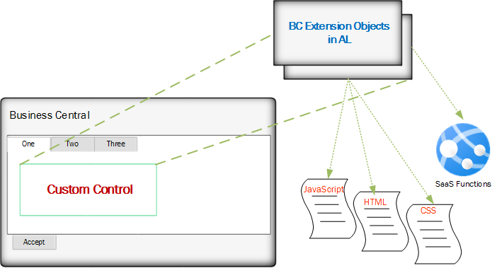

# Introduction to Custom Controls in AL

This is another in the Tigunia series of, by, and for developers. This module will present a very simple design and implementation of **Custom Controls**, JavaScript widgets or logic embedded into BC pages.

In NAV C/AL code, the more adventurous among us extended functionality and even integrated with other systems by writing custom DLLs in .NET and then calling those .NET modules from within the NAV code. As with these approaches, AL allows similar but different tools. 

This tutorial explores the concepts of those custom controls, provides an approach to building them, and demonstrates how to incorporate JavaScript widgets and page logic into Business Central.

The simple, four-part approach includes a brief introduction and demonstration of a hosted multi-tenant BC custom control, including:

* Description and design of NAV and BC *interoperability*
* An approach to build and prove the JavaScript addition <u>outside of BC</u>
* Show the code changes, structural and logical, when migrating to a BC environment 
and
* Making the custom control interactive with BC

## Architecture, Then and Now

NAV and BC share common business logic. The similarities end there. Remnants of the past remain, such as *objects* that aren't **objects**, and the textual layout of those objects reminds us of text exports of NAV, but the underlying architecture has changed.

Interoperability changed with it. With a vengance.

The reasons for the change are beyond anyone outside the Microsoft hive, but security and architecture certainly play a part.

## <a name="oldArch">Old Architecture</a>
In NAV using C/AL, add-ins written in .NET and added as DLLs in the *Add-ins* subfolder were acceptible, but no longer. The *security risks* posed by DLLs in a multi-tenant, online (cloud) environment have been deemed unacceptable. 

These can exist without compromising any security or integrity for one reason: **all aspects of old-style NAV existed inside a secure and bounded domain.

Even open-ended DLLs could only corrupt those systems accessible to it. Other NAV implementations were safe by action of network security and localization.

## <a name="newArch">New Architecture</a>
Protecting tenants in a SaaS architecture means extending internal tools that cannot compromise others across a session, but still allow different clients the use of powerful external and third-party tools.

In SaaS-based BC, the extended toolset runs from the client's browser, not from the local server. By activating JavaScript on the client browser, Microsoft provides some architectural extensibility without compromising security because BC in the browser has no more access to other tenants, extensions, or services than any other browser-based application.

*Business Central allows DLLs in **on-prem** implementations, demonstrating that the design and service changes from NAV to BC do not prohibit DLLs; but Azure and multi-tenancy does.*
  

 

As shown in this simple graph, the JavaScript custom control runs in the browser on the client's machine, not in the cloud. BC services *deliver* the JavaScript as part of the BC page, but the script runs <u>on the client's browser</u>.

We can show later that BC can send and receive data from the JavaScript logic running in the browser, but those actions must conform to only that already allowed from within AL. 

## <a name="control">Structure of a Custom Control</a>

The following graph shows the simplified architecture of a BC custom control.  

 
On the lower left is a dialog, representing Business Central. It displays a custom control in one of the pages. But what makes up a custom control?  

Every custom Control has the same basic structure. Two "objects" that exist as *.al files are as follows:

* A *Page* or *PageExtension* custom object
* A *CustomControl* object

Both of these have *.AL file extensions. While the *CustomControl* file/object does not use a standard AL object number it is still an AL object. It must be discoverable by the *Page* or *PageExtension* which consumes the custom control page.

The rest of the files used in a new custom control are either JavaScript (with a *.js extension), or Cascading Style Sheets (with a *.css extension).

Generically, they are:

* a startup.js
* the control.js itself
* a Cascading Style Sheet (optional)
* any additional JavaScript files (called by the control.js and also optional)

These files exist outside the native BC/AL environment. 

Each will be discussed and created during this training session.

<dl>
<dt style="font-style:italic;font-weight:bold;font-size:14px"><a href="">Note:</a></dt>
<dd>SaaS capability is shown as part of the extensibility archticture, but that topic exceeds the bounds of this tutorial. 

It is worth noting that JavaScript can also reach out to online services using AJAX, but that, too, exceeds the bounds of this tutorial.</dd>
</dl>

## <a name="widget">Tutorial Widget</a>
This demonstration uses a single, open-source JS widget, almost randomly selected for simplicity and availability. The widget, [DataTables](https://www.datatables.com), provides little value to a Dynamics Business Central envrionment, but provides enough training value &ndash; as well as simplicity for the tutorial &ndash; to be useful. 

A requirement very important to this tutorial, anyone can obtain this widget without cost and through both downloads and content delivery network (CDN). More on that later.
