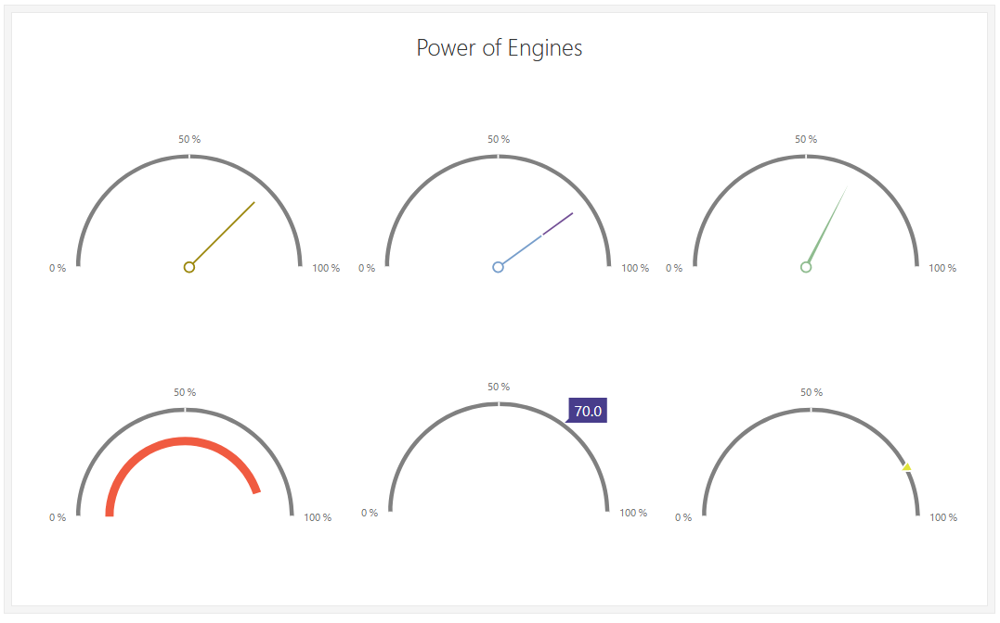
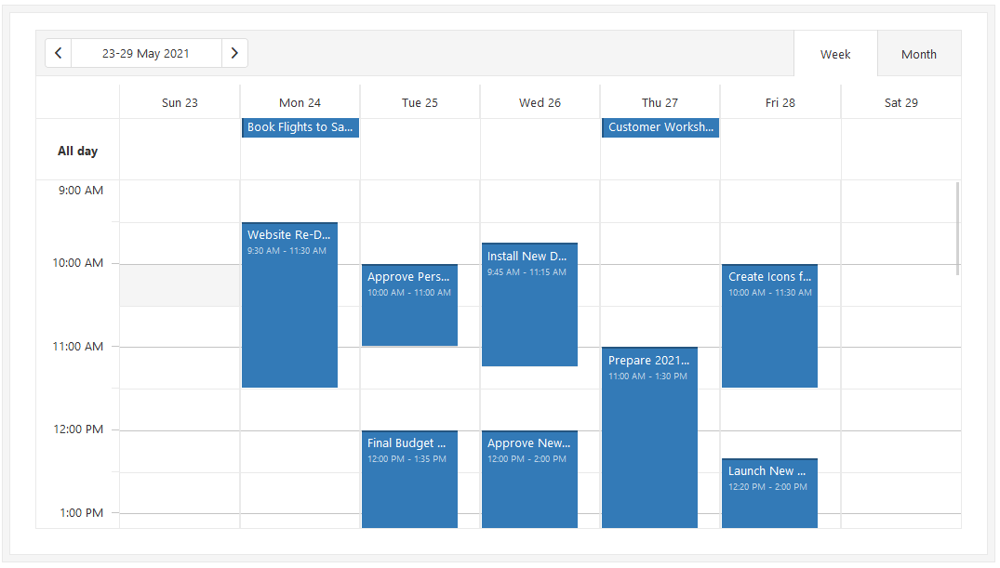
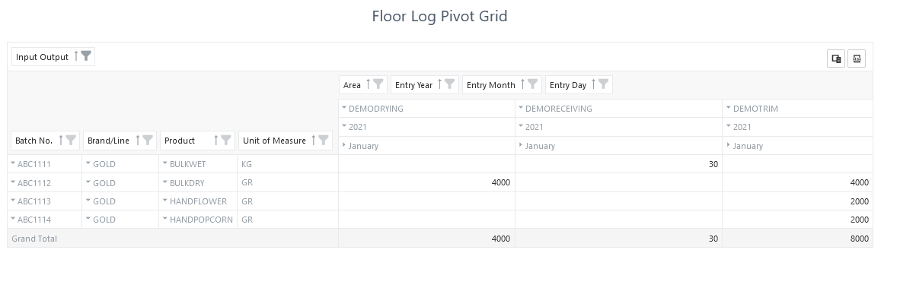

# JavaScript UI Components

Hello. I'm Jeff Stokes Du Bose and I'm your presenter for this tutorial. I'll present **JavaScript UI controls used as Control Add-ins in Business Central**. Before we start, I thought a brief tease of commercially-available, pre-built, impressive JavaScript UI controls might add motivation to stay awake during the boring parts of the tutorial.

As a prequel to the training, this brief introduction to the possible adds information and maybe sparks interest by developers who want the power that Control Add-ins can provide.

Business Central, despite its new name, remains a visual product of last decade. I'm sure the Microsoft folks have had quite a task just migrating the desktop UI of the '90s into a browser-based, multi-tenancy product, but they didn't add any capability or excitement to the UI along the way.

Well, that's not exactly right. They gave us a workbench and a couple of hooks to build our own additional UI presentation: Control Add-ins.

Control Add-ins allow visual extensions to Business Central: to add graphics and reporting and all manner of other presentation widgets on BC pages that would not be possible by coloring within the lines. 

As Tigunia explores and integrates Control Add-ins into our products and customizations, our *possible* differentiates us from the average.

# DevExpress

This prequel focuses on DevExpress tools: JavaScript UI controls that can be used in all manner of enhanced capabilities and exciting visual content embedded into our Business Central products.

Among other members of Tigunia, Marc has worked with DevExpress since around 2006. Their tools and controls are visually pleasing and remarkably well-documented, making their controls a marvelous source for Control Add-ins. 

Leveraging tools like the following inside a custom AL extension can be done with Control Add-ins in AL.

Charts and tools, like the Tree Map, can replace static and plain text reports with interactive graphic reporting .

A set of gauges make a better presentation than cues on role-center pages:

BC can become home to scheduling functions:

There are dozens of DevExpress UI controls.

And in a recent product, DevEx controls allowed Tig to provide on-the-fly configurable and embedded reporting grids that put most other reporting to shame.

# Real-Life Example

Recently, during the development of TigHC, our extension for managing cannabis processing, we needed several report types and enhancements that aren't supplied by AL code.

In TigHC, the managers can configure a pivot grid with the columns and rows they want, filter it as they see fit, and then view or even print to Excel.

Everything else in TigHC leverages configuration over customization. With this in mind, internal reporting had to include the ability for individual users to change layouts, filters, and dependencies.

When the need arose for a tree-view report in the Batch Traceability function, a DevEx tree was used.

And even for the almost boring grid report, the ability to arrange columns, pick and hide columns, set filters and save to Excel format made the DevEx Grid a perfect choice.

TigHC designers chose DevExpress controls for this purpose and incorporated them in TigHC as Control-Add-ins in custom AL pages.

Adding exciting and iconoclastic capabilities to AL extensions lies at the heart of invention at Tigunia. Providing both developers and their clients with visually-pleasing interfaces sets us all apart. Control Add-ins are where it starts, and the next tutorial will introduce and explain Control Add-ins in AL.

DevExpress controls aren't used in the following tutorial because they are a paid subscription. A free, and very simple, JavaScript control will take the place of DevEx and other controls for the tutorial. 

All of the information, techniques, and code used for the simpler control are valid for DevEx and any other JavaScript control.

I hope you enjoy the class.